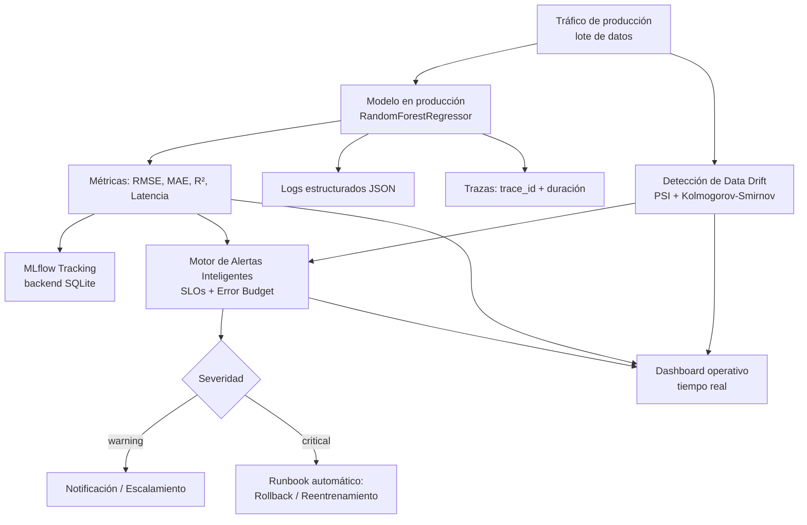

# Documento Técnico — Sistema de Monitorización Proactiva para un Modelo en Producción

**Caso de uso:** predicción del valor medio de vivienda (regresión) sobre el
*California Housing Dataset*, usando un modelo `RandomForestRegressor`
desplegado como servicio simulado en producción.

---

## 1. Objetivo

Diseñar e implementar un sistema de monitorización proactiva que permita
detectar de forma temprana problemas de desempeño, cambios en los datos
(*data drift*) y degradaciones del modelo en producción, y responder ante
ellos de forma estructurada y, cuando es posible, automatizada — priorizando
los incidentes según su impacto operativo real en el servicio.

## 2. Arquitectura general del sistema de observabilidad



El flujo es continuo: cada lote de datos que llega se predice, se mide, se
compara contra la referencia histórica, se evalúa contra los SLOs definidos,
y — si corresponde — dispara una respuesta automatizada, todo mientras
alimenta el dashboard operativo.

---

## 3. Definición de indicadores (métricas, logs, trazas)

### 3.1 Métricas

| Métrica | Qué mide | Por qué importa |
|---|---|---|
| **RMSE** (Root Mean Squared Error) | Magnitud del error de predicción, penalizando errores grandes | Detecta degradación general del modelo |
| **MAE** (Mean Absolute Error) | Error promedio absoluto | Complementa al RMSE; menos sensible a outliers |
| **R²** | Proporción de varianza explicada por el modelo | Detecta si el modelo dejó de capturar la relación real entre variables |
| **Latencia (ms)** | Tiempo de respuesta de la predicción | Detecta problemas de infraestructura/carga |
| **PSI por feature** | Cambio de distribución de cada variable de entrada respecto a la referencia | Detecta *data drift* antes de que impacte las métricas de negocio |
| **Error budget restante (%)** | Presupuesto de error aún disponible respecto al SLO | Traduce el desempeño técnico en impacto operativo/de negocio |

Todas las métricas se registran por lote (batch) en **MLflow**, lo que permite
ver su evolución temporal en la UI de tracking.

### 3.2 Logs

Cada evento relevante del sistema (una alerta disparada, un runbook ejecutado,
un fallo detectado) se registra como un **log estructurado en formato JSON**,
con los siguientes campos:

```json
{
  "timestamp": "2026-07-19T18:32:10.123Z",
  "nivel": "critical",
  "mensaje": "RMSE 1.45 supera el SLO (1.11) en el paso 12",
  "contexto": { "id": "a1b2c3d4", "name": "rmse_degradation", "severity": "critical" }
}
```

El uso de logs estructurados (en vez de texto libre) permite que, en un
entorno real, estos eventos sean fácilmente indexables por herramientas como
CloudWatch, Loki, Datadog o el propio ELK stack.

### 3.3 Trazas

Cada lote de datos procesado genera una traza con:
- `trace_id` único (UUID corto)
- Operación ejecutada (`procesar_lote`)
- Duración en milisegundos
- Metadatos del lote (número de paso, cantidad de registros)

Esto simula, a escala reducida, lo que sería una traza distribuida real en un
sistema de microservicios (por ejemplo, con OpenTelemetry), permitiendo
reconstruir el recorrido completo de una solicitud si algo falla.

---

## 4. Diseño de alertas inteligentes (SLOs y error budgets)

### 4.1 Calibración de los SLOs

En lugar de fijar umbrales arbitrarios, los SLOs se **calibran dinámicamente**
a partir del desempeño real del modelo sobre un conjunto de *holdout* (datos
no usados en el entrenamiento):

| SLO | Fórmula de calibración | Justificación |
|---|---|---|
| RMSE máximo aceptable | 1.3 × RMSE(holdout) | Margen de tolerancia sobre el error esperado en producción |
| MAE máximo aceptable | 1.3 × MAE(holdout) | Igual que arriba, con métrica menos sensible a outliers |
| R² mínimo aceptable | R²(holdout) − 0.15 | Tolera una caída moderada de ajuste sin considerarla aún crítica |
| Umbral de drift (PSI) | 2.0 (fijo) | Estándar de la industria ajustado a la escala de bucketing usada |

### 4.2 Error budget

El error budget se calcula sobre una **ventana móvil** de las últimas *N*
predicciones individuales. Una predicción se considera "exitosa" si su error
absoluto está por debajo de una tolerancia (1.5 × MAE de holdout). El
porcentaje de presupuesto restante se calcula como:

```
tasa_falla_permitida   = 1 − SLO_tasa_exito
tasa_falla_observada   = 1 − tasa_exito_observada (ventana móvil)
presupuesto_restante % = max(0, 1 − tasa_falla_observada / tasa_falla_permitida) × 100
```

Cuando el presupuesto llega a 0%, se considera que el servicio ya agotó el
margen de error tolerado por el negocio — esto se trata como **incidente
crítico**, independientemente de si alguna métrica individual ya cruzó su
umbral.

### 4.3 Priorización por impacto operativo

| Alerta | Severidad | Impacto operativo |
|---|---|---|
| `data_drift` | Warning | Riesgo futuro — el modelo aún puede estar funcionando bien, pero la base de datos que lo alimenta ya cambió |
| `latency_spike` | Warning | Afecta experiencia de usuario, no la calidad de la predicción |
| `rmse_degradation` / `r2_degradation` | **Critical** | El modelo ya está prediciendo mal — impacto directo en el negocio |
| `error_budget_exhausted` | **Critical** | El SLO acordado con el negocio ya se incumplió de forma sostenida |

### 4.4 Reducción de ruido (alert fatigue)

Cada tipo de alerta aplica un **cooldown**: si la misma condición persiste en
lotes consecutivos, no se vuelve a notificar hasta que pase el periodo de
enfriamiento configurado. Esto evita saturar al equipo de guardia con
notificaciones repetidas del mismo incidente aún no resuelto.

---

## 5. Descripción de los dashboards operativos

El dashboard operativo se organiza en **4 paneles**, pensados para apoyar
decisiones distintas en tiempo real:

| Panel | Qué muestra | Decisión que apoya |
|---|---|---|
| RMSE / MAE por paso | Evolución del error de predicción, con línea de SLO | ¿El modelo sigue prediciendo dentro de lo aceptable? |
| R² por paso | Evolución del ajuste del modelo, con línea de SLO mínimo | ¿El modelo sigue capturando la relación real de los datos? |
| PSI máximo (drift) | Evolución de la distancia entre distribución actual y de referencia | ¿Los datos de entrada siguen siendo representativos del entrenamiento? |
| Error budget restante (%) | Presupuesto de error disponible en el tiempo | ¿Cuánto margen queda antes de incumplir el SLO acordado con el negocio? |

Los pasos donde se dispararon alertas **críticas** se marcan con una línea
vertical en los 4 paneles simultáneamente, para poder correlacionar
visualmente el momento del incidente con el comportamiento de todas las
métricas a la vez.

> *(Insertar aquí la captura del dashboard generado por la celda de
> matplotlib del notebook, como evidencia visual — ver carpeta
> `evidencias/`.)*

---

## 6. Runbooks de respuesta a incidentes

Cada tipo de alerta tiene asociado un procedimiento de respuesta específico:

| Incidente detectado | Runbook | Procedimiento |
|---|---|---|
| Data drift en features de entrada | `reentrenamiento_automatico` + `notificar_equipo_guardia` | 1) Se dispara el pipeline de reentrenamiento con datos recientes. 2) Se notifica al equipo on-call para validar la causa raíz del cambio de distribución. |
| Degradación de RMSE / R² | `rollback_modelo` + `notificar_equipo_guardia` | 1) Se revierte el despliegue a la versión de modelo anterior conocida como estable. 2) Se notifica al equipo para investigar la causa de la degradación. |
| Incremento de latencia | `escalamiento_infraestructura` | Se escalan las réplicas del servicio para absorber la carga adicional. |
| Error budget agotado | `rollback_modelo` + `notificar_equipo_guardia` | Igual que degradación de métricas: se prioriza restaurar el servicio a un estado conocido como bueno antes de investigar la causa. |

El principio de diseño es: **las alertas críticas disparan una acción
correctiva inmediata (rollback) antes de investigar la causa raíz**,
priorizando restaurar el servicio; las alertas de tipo *warning* (como drift)
disparan acciones preventivas (reentrenamiento) que no requieren interrumpir
el servicio activo.

---

## 7. Estrategias de detección de data drift

Se utilizan dos técnicas estadísticas complementarias, aplicadas a cada una
de las 8 features de entrada:

### 7.1 PSI (Population Stability Index)

Mide qué tan distinta es la distribución actual de una variable respecto a su
distribución de referencia (la vista durante el entrenamiento), dividiendo el
rango de valores en *buckets* y comparando la proporción de datos en cada uno:

```
PSI = Σ (pct_actual − pct_referencia) × ln(pct_actual / pct_referencia)
```

Interpretación estándar de la industria:
- PSI < 0.1 → sin cambio relevante
- 0.1 – 0.25 → cambio moderado, monitorear
- \> 0.25 → cambio significativo

En este sistema se usa un umbral ajustado de PSI > 2.0 sobre el máximo entre
las 8 features, calibrado a la escala del método de *bucketing* empleado.

### 7.2 Prueba de Kolmogorov-Smirnov (KS)

Complementa al PSI con una prueba de hipótesis: compara las distribuciones
acumuladas de la muestra actual y la de referencia, devolviendo un p-valor.
Un p-valor bajo (< 0.05) indica evidencia estadística de que ambas muestras
provienen de distribuciones distintas.

### 7.3 Por qué ambas técnicas juntas

El PSI da una **magnitud** del cambio (útil para dashboards y para decidir
severidad), mientras que el KS da una **validación estadística** de que el
cambio observado no es simplemente ruido muestral. Usarlas en conjunto reduce
falsos positivos.

---

## 8. Documentación de respuesta automatizada

| Acción | Cuándo se dispara | Qué hace | Qué NO hace (requiere intervención humana) |
|---|---|---|---|
| **Rollback** | RMSE/R² fuera de SLO, o error budget agotado | Revierte el despliegue a la versión de modelo previa conocida como estable | No investiga la causa raíz de la degradación — eso queda para el equipo on-call |
| **Reentrenamiento automático** | Data drift detectado | Encola un pipeline de reentrenamiento con datos recientes | No despliega automáticamente el nuevo modelo — requiere validación antes de reemplazar el modelo en producción |
| **Escalamiento de infraestructura** | Incremento de latencia | Escala las réplicas del servicio | No resuelve la causa raíz del incremento de carga |
| **Notificación a guardia** | Cualquier alerta crítica o de drift | Envía el detalle de la alerta al canal de guardia (simulado) | No reemplaza el análisis humano del incidente |

Este diseño refleja una práctica común en MLOps: **automatizar la
contención inmediata del incidente (rollback, escalamiento), pero dejar las
decisiones de mayor impacto (desplegar un modelo reentrenado, cambiar la
arquitectura) sujetas a revisión humana.**

---

## 9. Resultados de la simulación de incidentes

*(Ver detalle completo, con las tablas de alertas y runbooks ejecutados
generadas por el notebook, en
[`incidentes/registro_incidentes.md`](../incidentes/registro_incidentes.md).)*

---

## 10. Herramientas utilizadas

- **MLflow** (backend SQLite) — tracking de métricas, parámetros y artefactos.
- **scikit-learn** — modelo `RandomForestRegressor`, dataset California Housing.
- **scipy** — pruebas estadísticas (KS-test) para detección de drift.
- **matplotlib** — generación del dashboard operativo.
- **pandas / numpy** — manipulación de datos y cálculos numéricos.
